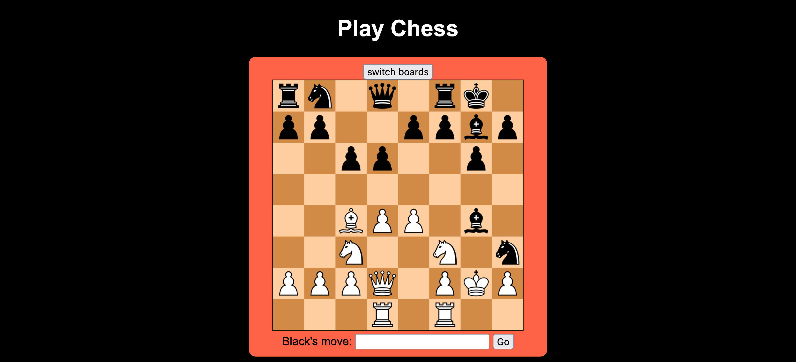

# Chess Wasm



## Running 
To run the repo, first build the rust implementation:
```bash
wasm-pack build --target web
```

Then run the server:
```bash
npx live-server
```

## APIs/Libraries
I used the following libraries and APIs:
* [owlchess](https://docs.rs/owlchess/latest/owlchess/)
* [fen-tool](https://mutsuntsai.github.io/fen-tool/)
* [FEN-to-image](http://www.fen-to-image.com/)